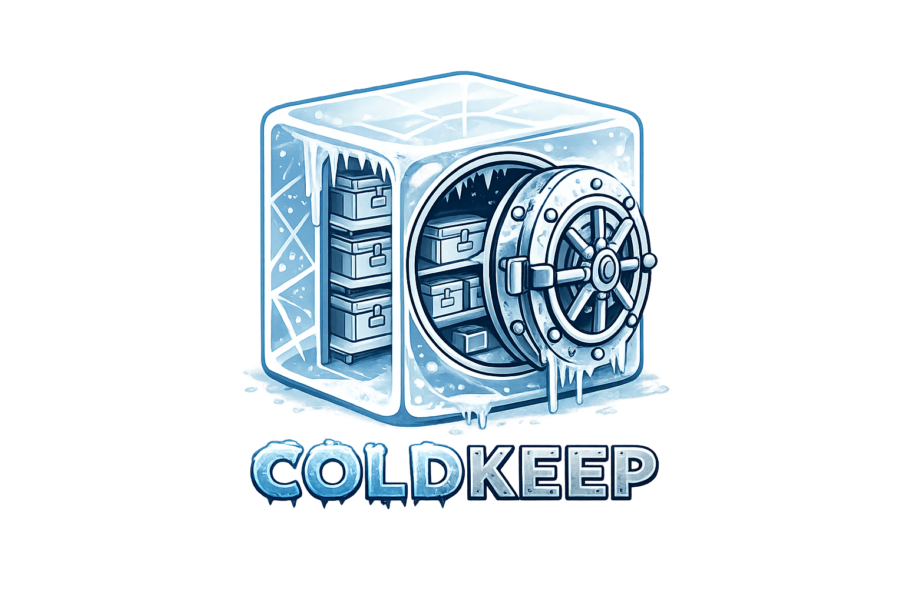
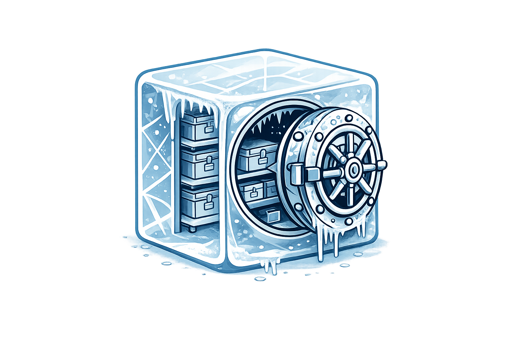

<p align="center">
  
</p>

<p align="center">
  Correctness-first cold storage engine
</p>

<p align="center">
  • Content-addressed • Built-in deduplication • Deterministic restore • Verifiable integrity • Crash-safe • GC-safe
</p>

## 🧊 Branding

<p align="left">
  
</p>

Coldkeep uses a visual identity based on an ice cube vault:

- cold storage (ice cube)
- secure data (vault door)
- structured containers (internal shelves)

# coldkeep


> Status: v1.1 adds an interface-correctness layer on top of the v1.0 storage-correctness core.

coldkeep is a local-first content-addressed storage engine focused on deterministic restore,
explicit integrity verification, and safe lifecycle behavior under failure scenarios.

## Why coldkeep?

coldkeep is designed for correctness-first cold storage.

Unlike traditional backup tools, it emphasizes:

- deterministic, byte-identical restore
- content-addressed deduplication
- explicit, test-backed integrity checks
- safe recovery and reference-safe garbage collection
- machine-readable CLI behavior suitable for automation

The goal is confidence and recoverability over maximum throughput.

## Status

Coldkeep currently has two explicit correctness layers:

- v1.0: storage correctness (restore determinism, integrity, recovery, GC safety)
- v1.1: interaction correctness (CLI orchestration, machine-readable contracts, batch semantics)

Guarantees are enforced through automated validation and CI gates.
See VALIDATION_MATRIX.md for guarantee-to-evidence mapping.

## Core Guarantees

### Summary

- deterministic, byte-identical restore
- no exposure of partially written or inconsistent data
- GC is reference-safe: no reachable chunk is ever deleted
- Atomic restore replacement (within single-node local filesystem semantics)
- Safe in-process concurrent storage operations

### Core invariants

Guarantee IDs are stable and tracked in VALIDATION_MATRIX.md:

- G1: deterministic, byte-identical restore
- G2: repeat store does not drift chunk graph
- G3: no exposure of partially written or inconsistent data
- G4: GC is reference-safe (no reachable chunk is deleted)
- G5: atomic restore replacement (single-node local filesystem semantics)
- G6: safe in-process concurrent storage operations
- G7: deep corruption detection (payload/offset/tail)
- G8: corrective health gate contract stability
- G9: deterministic batch CLI orchestration and automation-safe contract behavior

Coldkeep separates system understanding into:

- README.md (overview and usage)
- ARCHITECTURE.md (internal model and invariants)

For the deep model (invariants, lifecycle, validity, recovery, trust boundary), see ARCHITECTURE.md.

## When to use coldkeep

Good fit:

- cold/backup storage where correctness matters more than speed
- environments needing explicit integrity verification
- deduplication + deterministic restore use cases

Not a fit (v1.x scope):

- hot-path high-throughput storage
- distributed/multi-node coordination

## Quickstart

A small samples directory is included for local testing.

### Local (no Docker)

```bash
# 1) Initialize key material (.env)
coldkeep init

# 2) Load environment
export $(cat .env | xargs)

# 3) Store and inspect
coldkeep store samples/hello.txt
coldkeep stats

# 4) Restore
coldkeep restore 1 ./restored
```

Security note: if the encryption key is lost, encrypted data cannot be recovered.

### Docker

```bash
# 1) Start services
docker compose up -d --build

# 2) Initialize key material on host-mounted workspace
docker compose run --rm -v "$PWD:/app" coldkeep init

# 3) Store a sample file
docker compose run --rm \
  --env-file .env \
  -v "$PWD/samples:/samples" \
  coldkeep store /samples/hello.txt
```

## CLI Basics

Typical flows:

```bash
coldkeep store file.txt
coldkeep store-folder ./data
coldkeep restore 12 ./out
coldkeep remove 12
coldkeep gc
coldkeep stats
coldkeep list
coldkeep search report
coldkeep verify system --standard
coldkeep doctor
```

Simulation (no physical writes):

```bash
coldkeep simulate store-folder ./data
coldkeep simulate store file.txt --output json
```

## Batch Operations (v1.1)

Batch restore/remove expands v1.1 interface correctness for automation.

```bash
coldkeep restore 12 18 24 ./out
coldkeep remove 12 18 24
coldkeep remove --input ids.txt
coldkeep remove --stored-paths /data/a.txt /data/b.txt --input paths.txt
coldkeep repair ref-counts --batch --input repair_targets.txt
coldkeep restore 12 18 ./out --dry-run
```

Semantics (summary):

- per-item isolation by default
- optional fail-fast for execution failures
- duplicate target skipping
- deterministic per-item report ordering
- JSON status values: ok, partial_failure, error
- process exit is automation-friendly:
  - 0 when no item fails
  - 1 when one or more items fail

Clarifier: the binary 0/1 mapping applies to executed batch reports. Pre-execution validation/usage failures (including empty effective target sets after parsing input) return usage exit code 2.

For full batch contract details and examples, see ARCHITECTURE.md and PRE_RELEASE_CHECKLIST.md.

## Doctor (recommended health gate)

coldkeep doctor is the operator health gate:

- runs recovery first (corrective)
- then schema/version sanity checks
- then verification (standard by default; full/deep optional)

Doctor is intentionally corrective, not read-only.

```bash
coldkeep doctor
coldkeep doctor --full
coldkeep doctor --deep --output json
```

## Verification

Verification levels:

- standard: metadata integrity
- full: structural/container integrity
- deep: full content read + hash validation

```bash
coldkeep verify system --standard
coldkeep verify system --full
coldkeep verify system --deep
```

Verification checks are observational. In CLI flows, startup recovery may run before verification.

## Documentation Map

- Architecture and internals: ARCHITECTURE.md
- Guarantee mapping and evidence: VALIDATION_MATRIX.md
- Contribution workflow: CONTRIBUTING.md
- Release readiness flow: PRE_RELEASE_CHECKLIST.md
- Security reporting and threat guidance: SECURITY.md

## Roadmap note (v1.2 and beyond)

v1.2 is planned to introduce a physical_file to logical_file mapping layer to preserve
filesystem structure semantics more explicitly. This is an extension of the architecture,
not a reset of the core correctness model (G1-G9).

## Contributing

Contributions and discussions are welcome.
See CONTRIBUTING.md.

## License

Apache-2.0. See LICENSE.
